


 

 



 



 


click a card — repo if it has one, else the live deploy, else the demo

  

| | | | |
|---|---|---|---|
| [](https://github.com/blacksinisterx/Ai-UX-Auditor) | [](https://github.com/blacksinisterx/Exploit-Path-Tracer) | [](https://github.com/blacksinisterx/Deposition-Contradiction-Finder) | [](https://drive.google.com/file/d/1ZpO-nzMJUw8zg00oiZCB-ZGMa06_vxou/view) |
| [](https://github.com/blacksinisterx/Multi-Tenant-Agentic-RAG-System) | [](https://github.com/blacksinisterx/CrisSim-Multi-Agent-Simulation) | [](https://github.com/sincera315/Assignment3_Agentic_AI_N8N) | [](https://github.com/blacksinisterx/Ai-Video-Narrator) |
| [](https://github.com/blacksinisterx/Fact-Checker) | [](https://github.com/blacksinisterx/Clickbait-Decoder) | [](https://github.com/blacksinisterx/Ai-Slop-Blocker) | |

 

**ADDITIONAL FIELD WORK**
 
[Story2Audio](https://github.com/blacksinisterx/Story2Audio) · [MPCount](https://github.com/blacksinisterx/Computer-Vision-Project-Inventory-Count) · [Agentic OCR](https://github.com/blacksinisterx/Agentic-OCR) · Flight Delay Prediction (96% accuracy) · [Virtual Painter](https://github.com/blacksinisterx/Virtual-Painter) · [FAQ Chatbot](https://github.com/blacksinisterx/FAQ-Chatbot) · [GANs & VAEs](https://github.com/blacksinisterx/Generative-AI-Assignment-2-GANs-VAEs)

 


| | | |
|---|---|---|
| [](https://github.com/blacksinisterx/Agentic-AI-Safety-Audit) | [](https://github.com/blacksinisterx/federated-unlearning-multi-attack-evaluation) | [](https://storm-bureau-portfolio.vercel.app/) |
| [](https://storm-bureau-portfolio.vercel.app/) | [](https://github.com/blacksinisterx/Artificial-Neural-Network-Project) | |

 

 

  

<picture>
  <source media="(prefers-color-scheme: dark)" srcset="https://raw.githubusercontent.com/blacksinisterx/blacksinisterx/output/snake-dark.svg" />
  
</picture>

The language/repo stats card (github-readme-stats.vercel.app) is down at the time of writing — `503 DEPLOYMENT_PAUSED` on the shared public instance, a known issue with that free service, not something broken here. [Self-hosting it](https://vercel.com/import/project?template=https://github.com/anuraghazra/github-readme-stats) takes about two minutes if it's still down when you read this.

 


FILE NO. 0X47-AA — this document verifies itself. clone it, read the workflow, check the numbers.

